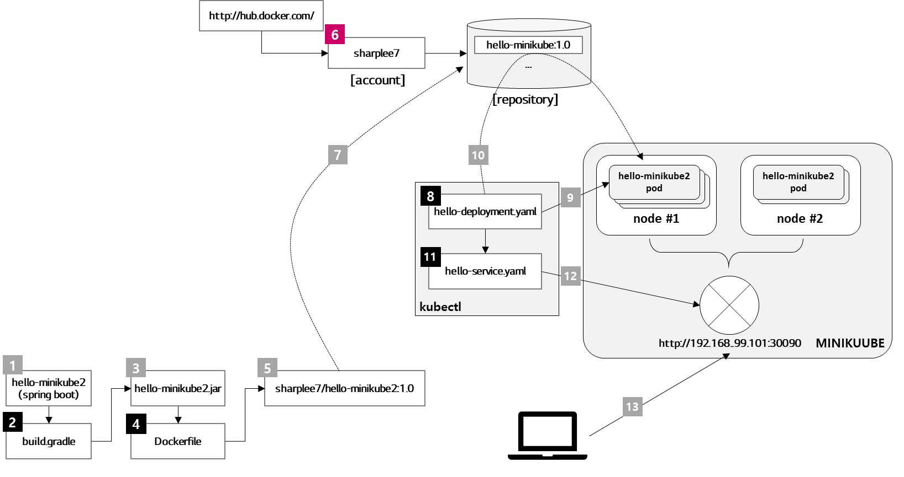

## 프로그램 실행 수순서

1.  hello-minikube2 앱을 spring boot에 gradle 기반으로 작성한다.
2.  build.gradle을 통해 컴파일 한다.
3.  hello-minikube2.jar 파일 생성
4.  Dockerfile 작성
5.  생성한 Dockerfile을 이용해 sharplee7/hello-minikube2:1.0 이미지를 만든다.
6.  docker hub(http://hub.docker.com)에 사용자 계정을 만들도록 한다.(이미 만들어져 있으면 skip한다.)
7.  docker push 명령어를 통해 5. 에서 생성한 sharplee7/hello-minikube2:1.0 이미지를 docker hub의 Repository에 push 한다.
8.  Minikube에 배포를 위해 hello-deployment.yaml 파일을 작성한다.
9.  kubectl 명령어를 이용해 Minikube 클러스터에 hello-minikube2 이미지를 배포한다.
10. hello-deployment.yaml 파일에 표시되어 있는 Image Repository에서 Container Image를 Pull 해온다.
11. 배포된 hello-minikube2 앱을 외부에서 접속할 수 있도록 IP:Port를 노출하기 위해 hello-service.yaml 파일을 작성한다.
12. kubectl -f 명령어를 통해 정의된 서비스 타입으로 배포된 hello-minikube2 애플리케이션의 IP:Port를 노출시킨다.
13. minikube service hello-minikube2 명령어를 통해 외부에서 접속 가능한 IP:Port를 확인 후 웹브라우저를 기동시켜 hello API를 테스트 해본다.
